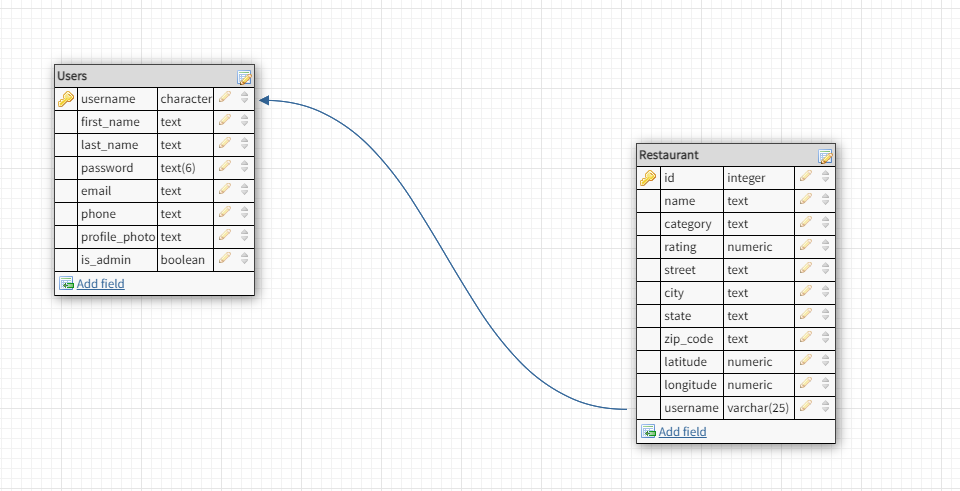

## Description
Click To Eat app is a food delivery platform that makes getting great food from your favorite local restaurants. This app connects you with a broad range of restaurants and food, so you can order from the full menus of your favorites food whenever you want.

## Features
- Access to the app as a user
- View available restaurants by searching the restaurant's name and location
- Location search input have used the mapbox autocomplete api
- Order your favorites food on your favorites local restauran
- Post new restaurant by create a pin on map and shows list of all posted restaurant
- Delete posted job
- Edit user's profile

## Installation
In the project directory, you can run:

### `npm start`

Runs the app in the development mode.\
Open [http://localhost:3000](http://localhost:3000) to view it in the browser.

The page will reload if you make edits.\
You will also see any lint errors in the console.

### `npm test`

Launches the test runner in the interactive watch mode.\
See the section about [running tests](https://facebook.github.io/create-react-app/docs/running-tests) for more information.

## APIs for this APP:
- [Yelp API](https://www.yelp.com/developers/documentation/v3)
- [Mapbox API](https://docs.mapbox.com/mapbox-gl-js/api/map/)

## User Flow
- Click To Eat is built for ordering online food, so at the homepage there are 2 buttons for “signup” and “Login”. If you didn't create an account, you should click on the signup button and create your account, then login with your valid username and password. When you Logged in you will visit restaurants page. 
- At the restaurant page you have two types of search, you can search by restaurant’s name, and also you can search by city. By searching, information about restaurants will show up. Information includes picture, name, rating, review count, transaction(delivery, pickup), categories, phone, and restaurant’s map. If you click on name or picture you will go to the selected restaurant page and you will see the restaurant's menu for order. All restaurants show up on the map on their latitude and logitude address. If you click on restaurant pin on map popup appears and you can see details of each restaurant. 
- After logging, the navbar will be changed to a different menu including logout, username, restaurant, my favorites.
- If you click on the username menu, a profile page will appear. In this page you will see all information about your account, and you can edit your profile.
- If you click on the restaurant menu on the navbar, the search page will appear.
- If you click on the my favorites menu on the navbar, you can create your favorites restaurant on the map, Also you can delete your own favorites restaurants.

## Technologies
- Frontend
    - React.js
    - Redux
    - React-Redux
    - React-bootstrap
    - bootstrap
    
- Backend 
    - Node.js
    - Express
    - Axios
    - PostgreSQL    

## Database Schema:

